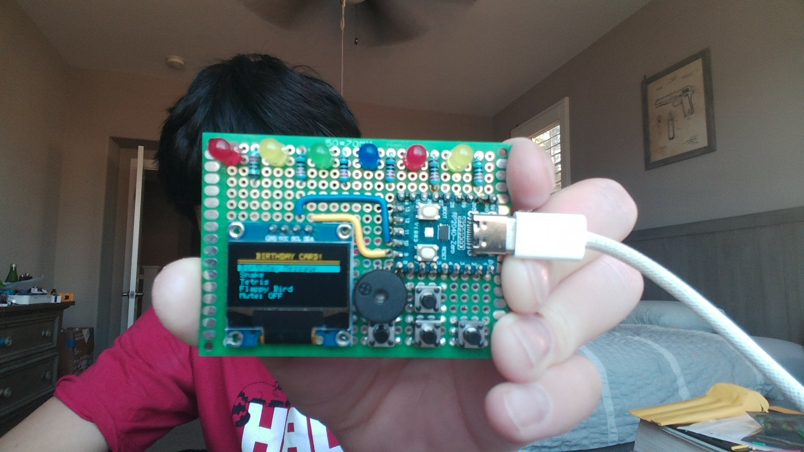
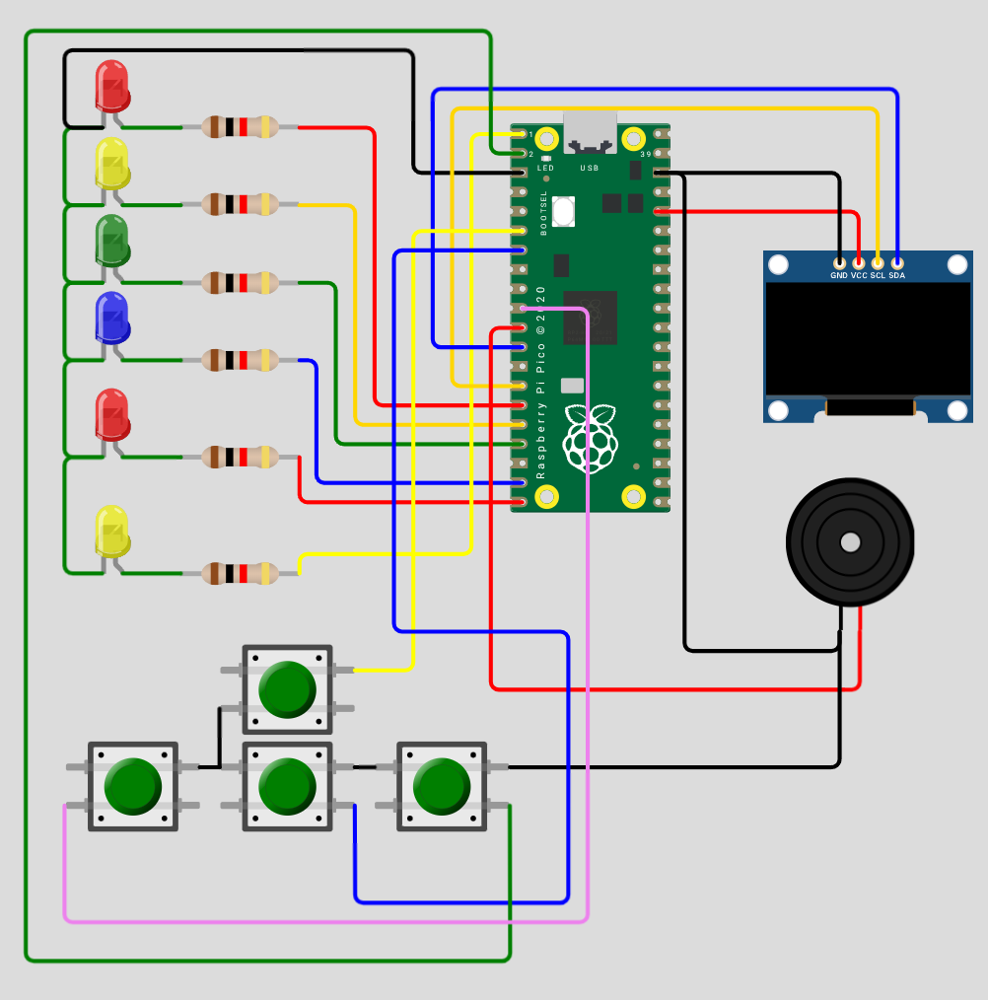
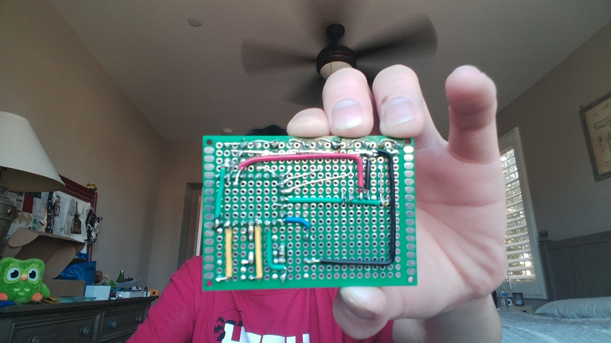

# Bday_Card
A birthday card for my friend! I was too lazy to write with good handwriting so I spent 3 hours doing this instead :P

# Assembly

Assembly is pretty easy! It took me a little less than two hours to get everything soldered. 

- LED1 - GPIO11
- LED2 - GPIO12
- LED3 - GPIO13
- LED4 - GPIO14
- LED5 - GPIO15
- LED6 - GPIO0
- OLED SCL - GPIO10
- OLED SDA - GPIO9
- Passive Buzzer - GPIO8
- Up - GPIO4
- Down - GPIO5
- Right - GPIO1
- Left - GPIO6

Here's the wiring diagram in Wokwi if you need it: keep in mind that I used a full Pico while in reality you should use a Waveshare RP2040 Zero. The pinout is still correct, though. 

LEDs' VCCs should be on row R, columns 1, 5, 9, 13, 17, and 21. Their GND's should be in the same columns but in row Q. One end of each resistor should go in row R, columns 3, 7, 11, 15, 19, and 23, and the other end of each resistor should go in the same column but in row O. Bend the LEDs' GND legs over toward the MCU so that each leg touches the next. Connect them to the ground. You'll have to sorta figure out the VCC connections (through the 220 ohm resistors of course), you can take a look below to see what I did. OLED GND should go into K5 and VCC into K6. Passive buzzer VCC into F13 and GND into E16 (yes I know it's tilted, it's the only way it'll fit, trust me). Up button into F17, F20, D17, D20. Down to C17, C20, A17, A20. Left button into A13, A16, C13, C16. Right button into A21, A24, C21, C24. Again, you may look below to see what I did to get everything connected (don't be shy with solder bridges!)

# Flashing

Copy/paste the code onto Arduino IDE and export the compiled binary. You'll need the U8g2 library. Flash onto the RP2040 and it should start working! Feel free to customize the code yourself. This code has some Animal Crossing refrences cuz my friend plays animal crossing. 

# AI Use

AI was used to debug the code. 
